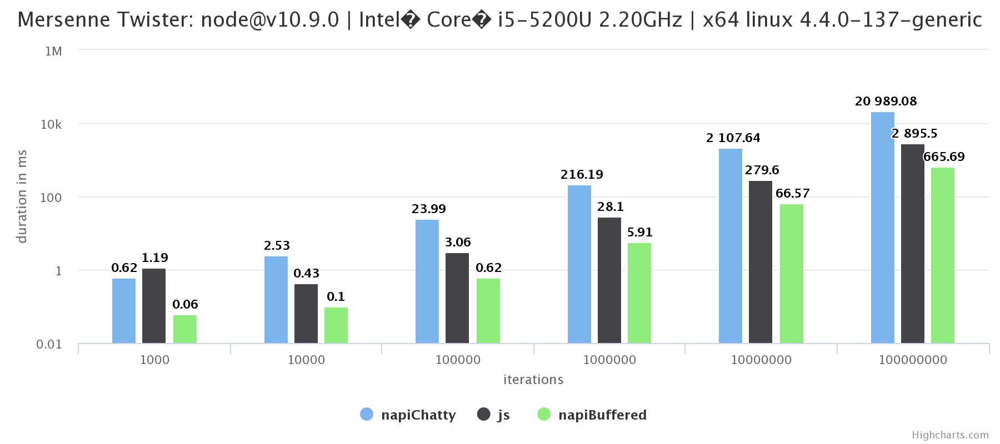
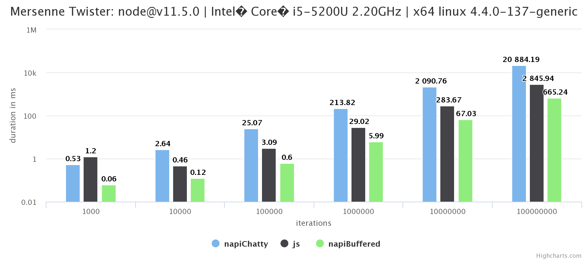
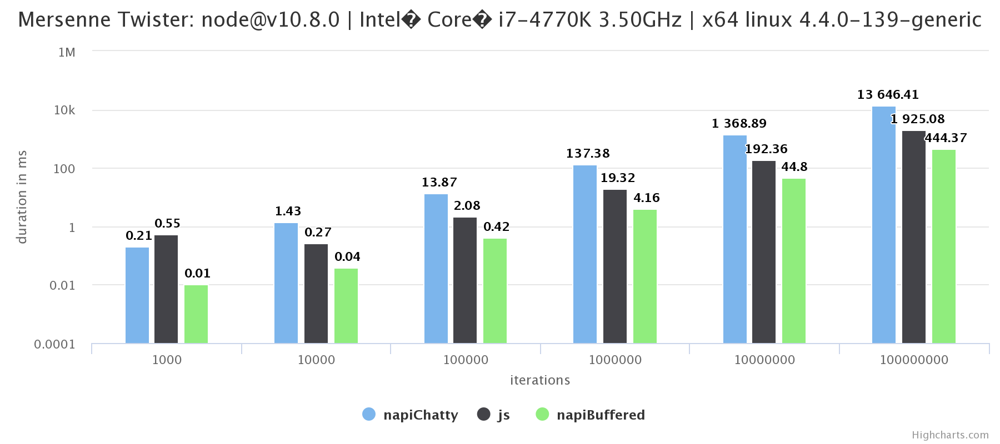

# N-API Mersenne Twister

Mersenne Twister with 3 different implementations:

1. JS via module [mersenne twister](https://www.npmjs.com/package/mersenne-twister)
2. NAPI chatty: every `next()` calls into native module (iteration in JS)
3. NAPI buffered: `load(buf)` will fill buffer with next values (iteration in C++)

## Installation
`npm ci`

## Compile (Release)
`npm run compile`

## Run

will make iterations of 1000, 10000, 100000, 1000000, 10000000, 100000000 and repeat it 10 times using average values in chart

`node start`
will create a `measurements/measurement-...json` file

## See result (no server needed, just a browser)
- open `measurements.html` with your browser
- "upload" json file in it

shows average values (of the 10 values) for each column chart

## Results

